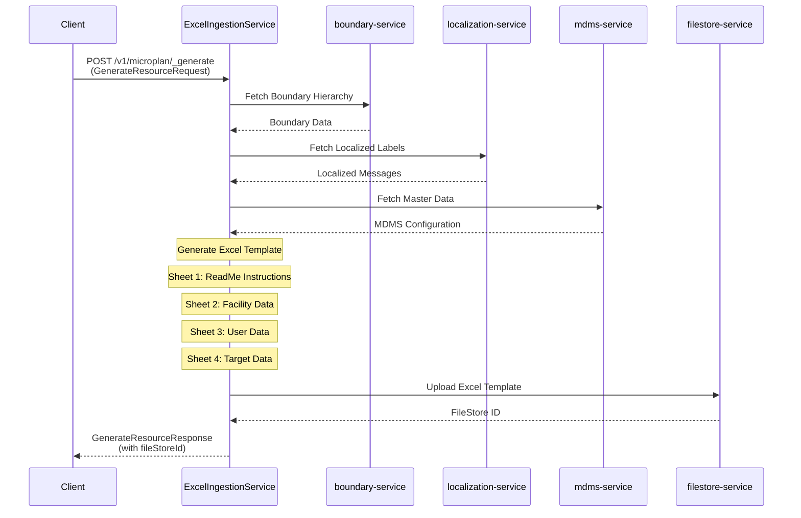
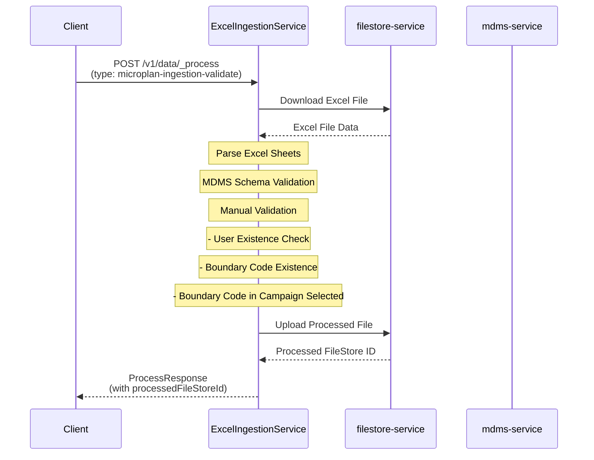
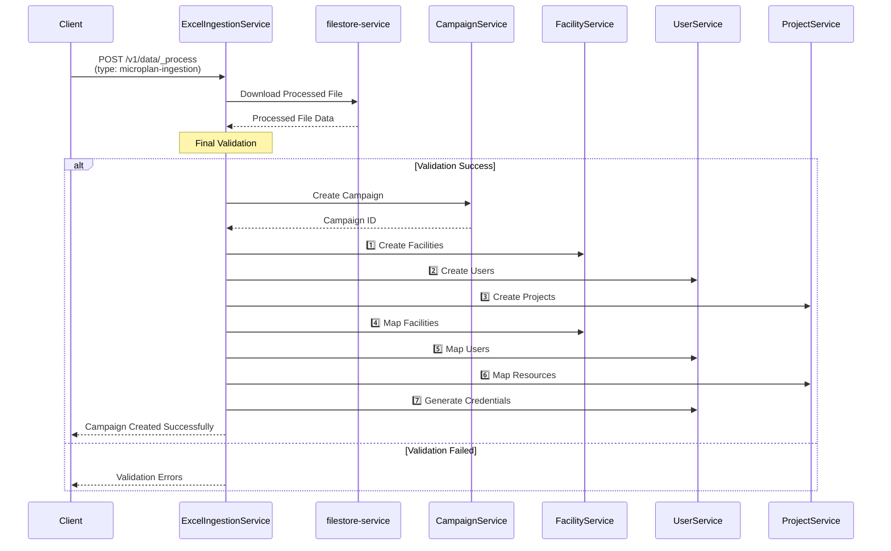

# Unified Microplan Workflow Design

## 1. Excel Template Generation

```mermaid
sequenceDiagram
    participant Client
    participant ExcelIngestionService
    participant boundary-service
    participant localization-service
    participant mdms-service
    participant filestore-service
    
    Client->>ExcelIngestionService: POST /v1/microplan/_generate<br/>(GenerateResourceRequest)
    
    ExcelIngestionService->>boundary-service: Fetch Boundary Hierarchy
    boundary-service-->>ExcelIngestionService: Boundary Data
    
    ExcelIngestionService->>localization-service: Fetch Localized Labels
    localization-service-->>ExcelIngestionService: Localized Messages
    
    ExcelIngestionService->>mdms-service: Fetch Master Data
    mdms-service-->>ExcelIngestionService: MDMS Configuration
    
    Note over ExcelIngestionService: Generate Excel Template
    Note over ExcelIngestionService: Sheet 1: ReadMe Instructions
    Note over ExcelIngestionService: Sheet 2: Facility Data
    Note over ExcelIngestionService: Sheet 3: User Data  
    Note over ExcelIngestionService: Sheet 4: Target Data
    
    ExcelIngestionService->>filestore-service: Upload Excel Template
    filestore-service-->>ExcelIngestionService: FileStore ID
    
    ExcelIngestionService-->>Client: GenerateResourceResponse<br/>(with fileStoreId)
```

## 2. Validation Process (microplan-ingestion-validate)

```mermaid
sequenceDiagram
    participant Client
    participant ExcelIngestionService
    participant filestore-service
    participant mdms-service
    
    Client->>ExcelIngestionService: POST /v1/data/_process<br/>(type: microplan-ingestion-validate)
    
    ExcelIngestionService->>filestore-service: Download Excel File
    filestore-service-->>ExcelIngestionService: Excel File Data
    
    Note over ExcelIngestionService: Parse Excel Sheets
    Note over ExcelIngestionService: MDMS Schema Validation
    Note over ExcelIngestionService: Manual Validation
    Note over ExcelIngestionService: - User Existence Check
    Note over ExcelIngestionService: - Boundary Code Existence
    Note over ExcelIngestionService: - Boundary Code in Campaign Selected
    
    ExcelIngestionService->>filestore-service: Upload Processed File
    filestore-service-->>ExcelIngestionService: Processed FileStore ID
    
    ExcelIngestionService-->>Client: ProcessResponse<br/>(with processedFileStoreId)
```

## 3. Campaign Creation Process (microplan-ingestion)

```mermaid
sequenceDiagram
    participant Client
    participant ExcelIngestionService
    participant filestore-service
    participant CampaignService
    participant FacilityService
    participant UserService
    participant ProjectService
    
    Client->>ExcelIngestionService: POST /v1/data/_process<br/>(type: microplan-ingestion)
    
    ExcelIngestionService->>filestore-service: Download Processed File
    filestore-service-->>ExcelIngestionService: Processed File Data
    
    Note over ExcelIngestionService: Final Validation
    
    alt Validation Success
        ExcelIngestionService->>CampaignService: Create Campaign
        CampaignService-->>ExcelIngestionService: Campaign ID
        
        ExcelIngestionService->>FacilityService: 1️⃣ Create Facilities
        ExcelIngestionService->>UserService: 2️⃣ Create Users
        ExcelIngestionService->>ProjectService: 3️⃣ Create Projects
        ExcelIngestionService->>FacilityService: 4️⃣ Map Facilities
        ExcelIngestionService->>UserService: 5️⃣ Map Users
        ExcelIngestionService->>ProjectService: 6️⃣ Map Resources
        ExcelIngestionService->>UserService: 7️⃣ Generate Credentials
        
        ExcelIngestionService-->>Client: Campaign Created Successfully
    else Validation Failed
        ExcelIngestionService-->>Client: Validation Errors
    end
```
