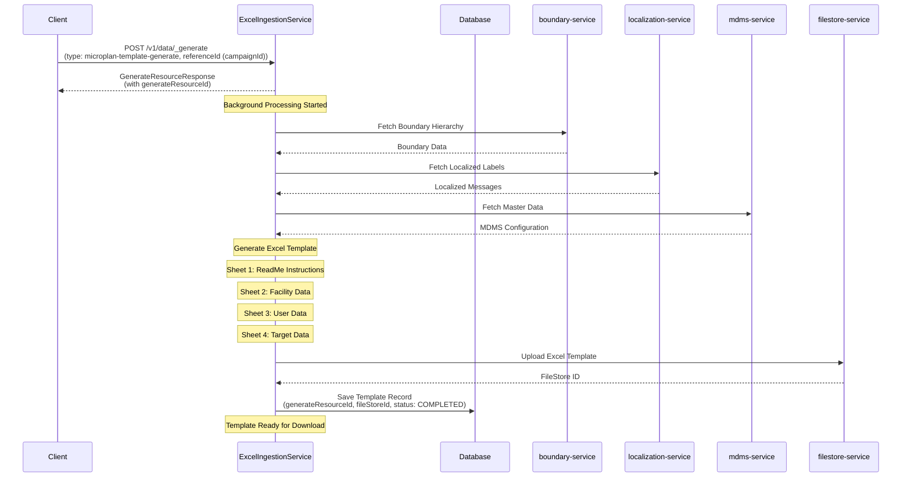
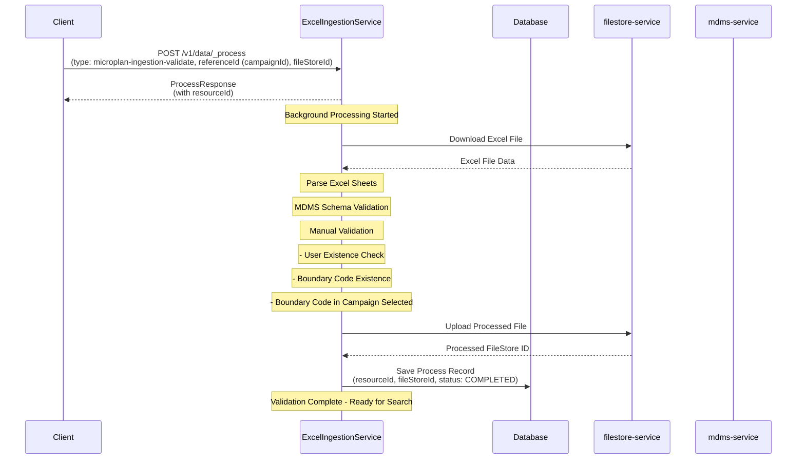
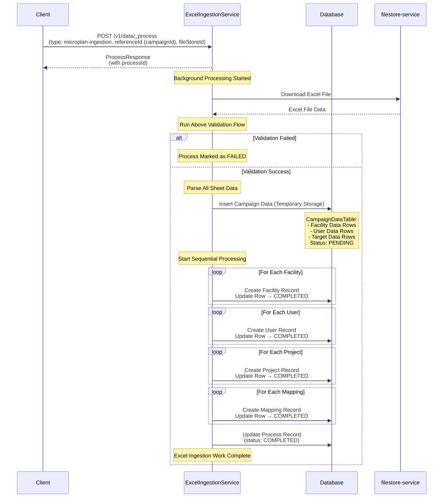
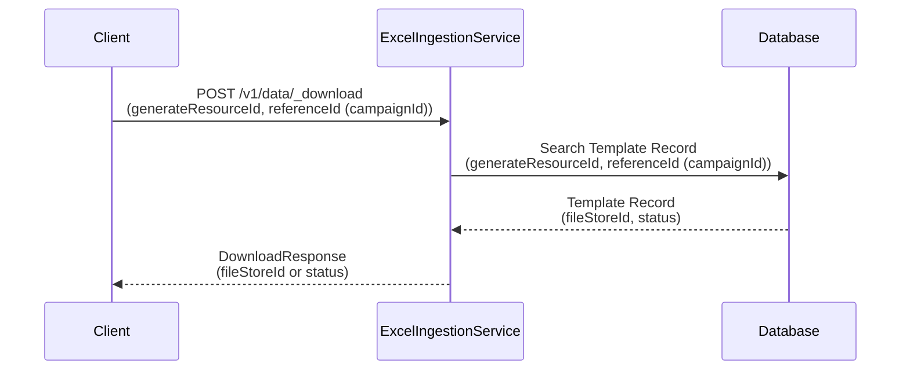
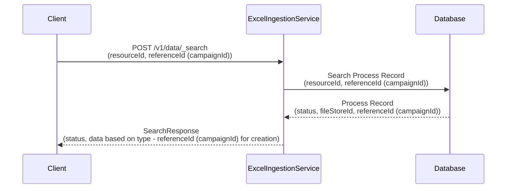
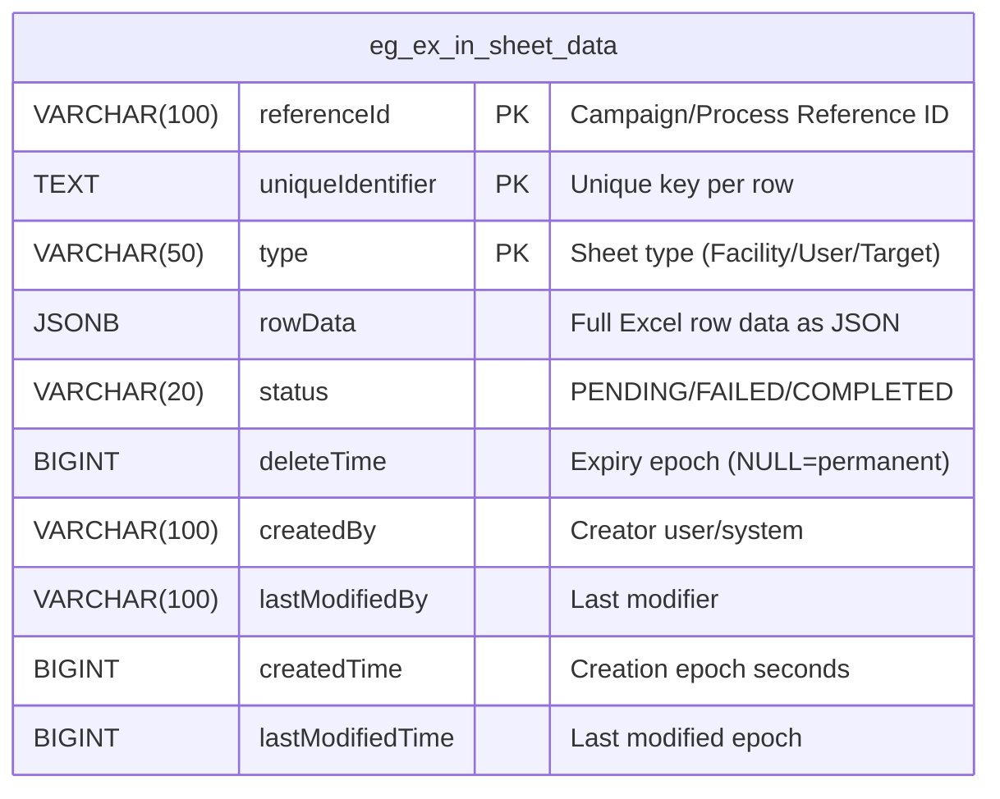

# Unified Microplan Workflow Design

## 1. Excel Template Generation
**Type:** `microplan-template-generate`  
**API:** `POST /v1/data/_generate` (Async - returns generateResourceId)
**Download API:** `POST /v1/data/_download` (returns fileStoreId)



## 2. Validation Process
**Type:** `microplan-ingestion-validate`  
**API:** `POST /v1/data/_process` (Async - returns resourceId)
**Search API:** `POST /v1/data/_search` (returns process status & fileStoreId if complete)



## 3. Data Storage & Campaign Creation
**Type:** `microplan-ingestion`  
**API:** `POST /v1/data/_process` (Async - returns processId)  
**Search API:** `POST /v1/data/_search` (returns process status & referenceId (campaignId) if complete)



## 4. Download API (For Template Generation)
**API:** `POST /v1/data/_download`



## 5. Search API (For Process Status)
**API:** `POST /v1/data/_search`



## 6. Sheet Data Table Documentation
**Table Name:** `eg_ex_in_sheet_data`

This table provides row-wise temporary storage for the Excel ingestion workflow.
Each row represents a record from an Excel sheet, linked to a campaign/process.

### Database Schema Diagram


### Keys
**Primary Key:** (referenceId, uniqueIdentifier, type)
- Ensures uniqueness of rows per campaign/process per sheet type.

### Purpose & Usage
- **Staging Table:** Temporary storage of Excel sheet rows before final ingestion.
- **Validation & Tracking:**
  - Each row has a status → track validation or processing result.
- **Temporary vs Permanent Rows:**
  - deleteTime = NULL → row is permanent.
  - deleteTime = epoch → row can be purged after that time.
- **Row Data Flexibility:**
  - rowData as JSONB allows storing arbitrary columns from Excel without altering table schema.

### Example: SQL Create Table Script
```sql
CREATE TABLE eg_ex_in_sheet_data (
    referenceId VARCHAR(100) NOT NULL,
    uniqueIdentifier TEXT NOT NULL,
    type VARCHAR(50) NOT NULL,
    rowData JSONB NOT NULL,
    status VARCHAR(20) NOT NULL,
    deleteTime BIGINT,            -- NULL = permanent
    createdBy VARCHAR(100),
    lastModifiedBy VARCHAR(100),
    createdTime BIGINT,           -- epoch seconds, set by application
    lastModifiedTime BIGINT,      -- epoch seconds, set by application
    PRIMARY KEY (referenceId, uniqueIdentifier, type)
);
```


