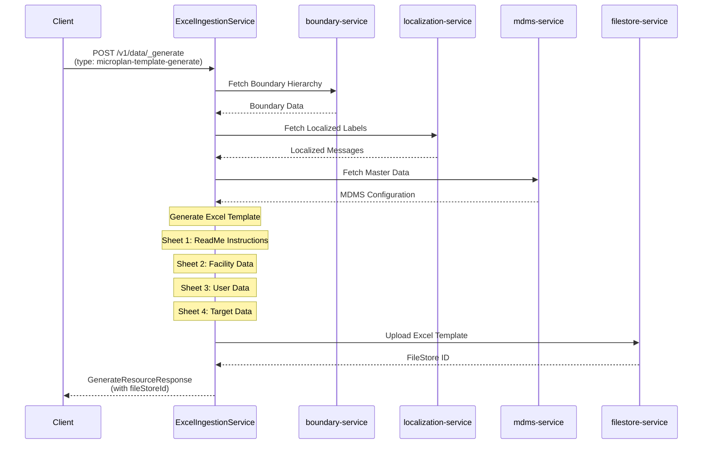
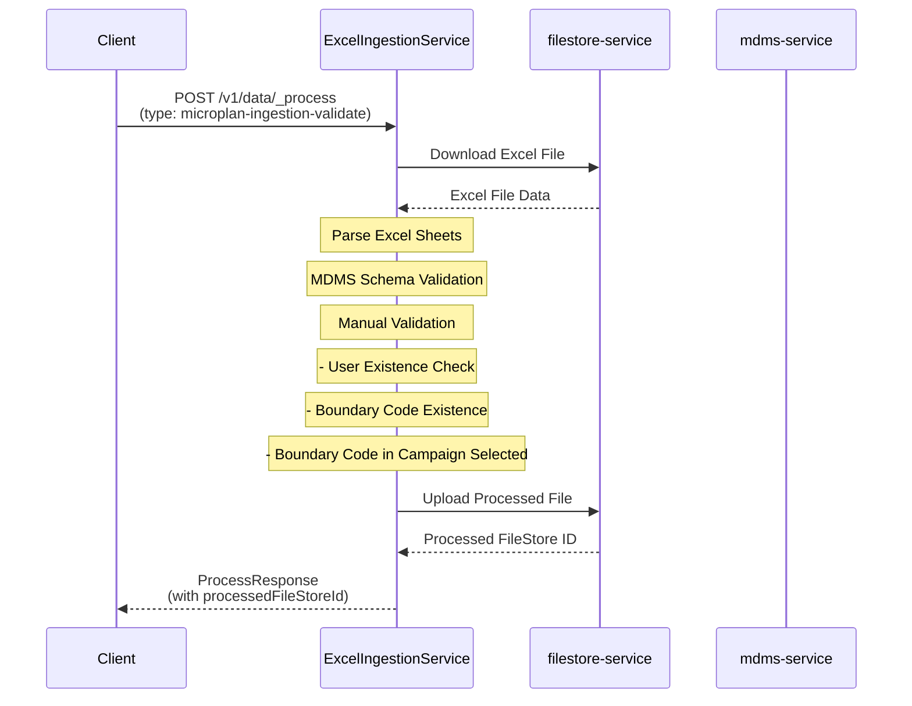
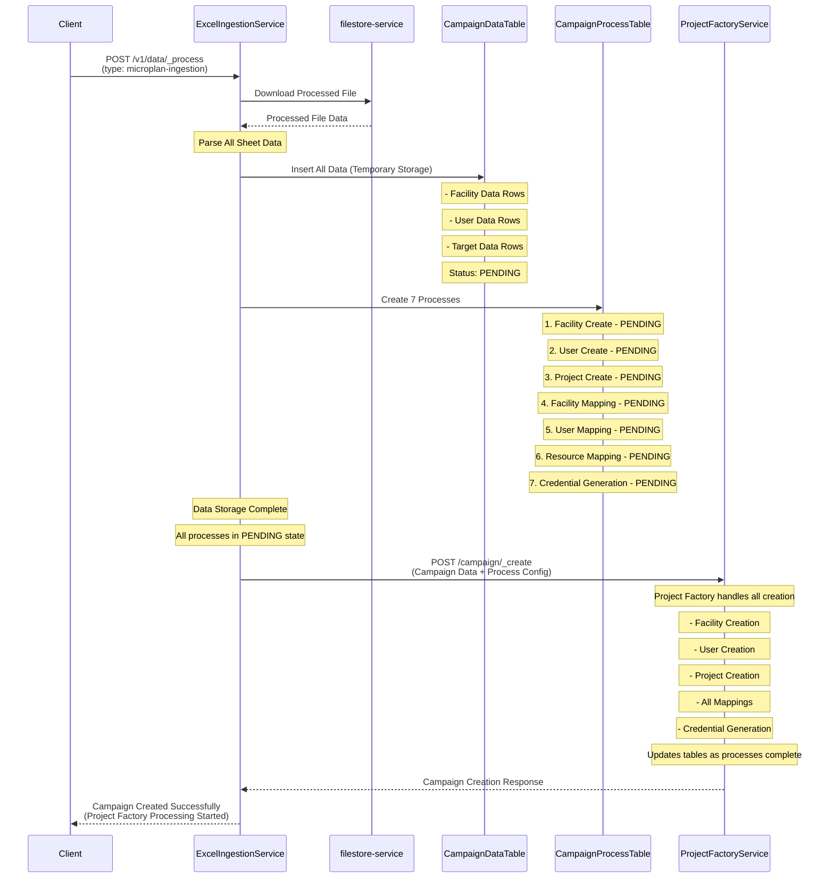

# Unified Microplan Workflow Design

## 1. Excel Template Generation
**Type:** `microplan-template-generate`  
**API:** `POST /v1/data/_generate`

## 2. Validation Process
**Type:** `microplan-ingestion-validate`  
**API:** `POST /v1/data/_process`

## 3. Data Storage & Campaign Creation
**Type:** `microplan-ingestion`  
**API:** `POST /v1/data/_process`

