# Unified Microplan Workflow Design

## Current vs New Approach

| **Current** | **New Proposed** |
|-------------|------------------|
| Generate 3 separate sheets | Generate 1 combined microplan sheet |
| Process each sheet individually | Process all data together |

## New Workflow Architecture

### Step 1: Single Template Generation
**One Comprehensive Template containing:**
- 🏥 **Facility Data Sheet**
- 👥 **User Data Sheet** 
- 🎯 **Target Data Sheet**

### Step 2: Unified Validation & Processing
- **Process API:** Single call validates entire sheet
- **Upload:** All 3 data types in one submission
- **Validation:** Combined validation for all sections

### Step 3: Campaign Creation
- **Campaign Create API:** Store all validated data
- **Single Campaign:** All data types under one campaign
- **Status Tracking:** Monitor processing progress

### Step 4: Sequential Processing Pipeline (7 Operations)

```
1. 🏥 Facility Create
2. 👥 User Create  
3. 🎯 Target/Project Create
4. 🔗 Facility Mapping
5. 🔗 User Mapping
6. 🔗 Resource Mapping
7. 🔑 User Credential Generation
```

## Complete Flow Diagram

```mermaid
sequenceDiagram
    participant Client
    participant ExcelIngestionService
    participant boundary-service
    participant localization-service
    participant mdms-service
    participant filestore-service
    participant CampaignService
    participant FacilityService
    participant UserService
    participant ProjectService
    
    Client->>ExcelIngestionService: POST /v1/microplan/_generate<br/>(GenerateResourceRequest)
    
    Note over ExcelIngestionService: Validate Request
    
    ExcelIngestionService->>boundary-service: Fetch Boundary Hierarchy<br/>(tenantId, hierarchyType)
    boundary-service-->>ExcelIngestionService: Boundary Data
    
    ExcelIngestionService->>localization-service: Fetch Localized Labels<br/>(locale, module, tenantId)
    localization-service-->>ExcelIngestionService: Localized Messages
    
    ExcelIngestionService->>mdms-service: Fetch Master Data<br/>(schemas, configurations)
    mdms-service-->>ExcelIngestionService: MDMS Configuration
    
    Note over ExcelIngestionService: Generate Unified Excel Template
    Note over ExcelIngestionService: Sheet 1: Facility Data
    Note over ExcelIngestionService: Sheet 2: User Data  
    Note over ExcelIngestionService: Sheet 3: Target Data
    Note over ExcelIngestionService: Sheet 4: ReadMe Instructions
    
    ExcelIngestionService->>filestore-service: Upload Excel Template
    filestore-service-->>ExcelIngestionService: FileStore ID
    
    ExcelIngestionService-->>Client: GenerateResourceResponse<br/>(with fileStoreId)
    
    Note over Client: User fills template<br/>and uploads data
    
    Client->>ExcelIngestionService: POST /v1/microplan/_process<br/>(ProcessRequest with fileStoreId)
    
    ExcelIngestionService->>filestore-service: Download Excel File
    filestore-service-->>ExcelIngestionService: Excel File Data
    
    Note over ExcelIngestionService: Parse & Validate All Sheets
    Note over ExcelIngestionService: Cross-validate relationships
    Note over ExcelIngestionService: Facility-User mappings
    Note over ExcelIngestionService: User-Target assignments
    
    alt Validation Failed
        ExcelIngestionService-->>Client: Validation Errors
    else Validation Success
        ExcelIngestionService->>CampaignService: POST /campaign/_create<br/>(unified campaign data)
        CampaignService-->>ExcelIngestionService: Campaign ID
        
        Note over ExcelIngestionService: Start Sequential Processing
        
        ExcelIngestionService->>FacilityService: 1️⃣ Create Facilities
        FacilityService-->>ExcelIngestionService: Facility IDs
        
        ExcelIngestionService->>UserService: 2️⃣ Create Users
        UserService-->>ExcelIngestionService: User IDs
        
        ExcelIngestionService->>ProjectService: 3️⃣ Create Projects/Targets
        ProjectService-->>ExcelIngestionService: Project IDs
        
        ExcelIngestionService->>FacilityService: 4️⃣ Map Facilities
        FacilityService-->>ExcelIngestionService: Mapping Success
        
        ExcelIngestionService->>UserService: 5️⃣ Map Users to Facilities
        UserService-->>ExcelIngestionService: User Mapping Success
        
        ExcelIngestionService->>ProjectService: 6️⃣ Map Resources to Projects
        ProjectService-->>ExcelIngestionService: Resource Mapping Success
        
        ExcelIngestionService->>UserService: 7️⃣ Generate User Credentials
        UserService-->>ExcelIngestionService: Credentials Generated
        
        ExcelIngestionService-->>Client: ProcessResponse<br/>(Campaign Created Successfully)
    end
```



## Key Benefits

| **Benefit** | **Description** |
|-------------|-----------------|
| **Simplified UX** | Users upload one sheet instead of three separate sheets |
| **Atomic Operation** | All data validated together, reducing inconsistencies |
| **Better Error Handling** | Single validation point for all related data |
| **Streamlined Process** | One unified workflow instead of three parallel ones |
| **Data Consistency** | Cross-section validation (facility-user relationships) |
| **Reduced Complexity** | Fewer API calls and fewer potential failure points |

## Implementation Requirements

### 1. Sheet Generator Updates
- **Combined Template:** Generate unified microplan sheet
- **Section Headers:** Clear separation of facility/user/target sections
- **Cross-references:** Maintain relationships between sections

### 2. Process API Enhancements
- **Multi-type Parsing:** Handle facility + user + target data in single call
- **Cross-section Validation:** Validate relationships across data types
- **Unified Error Reporting:** Consolidated error feedback

### 3. Campaign API Modifications
- **Temporary Storage:** Store multi-type campaign data temporarily
- **Data Structure:** Support combined facility/user/target storage
- **Status Tracking:** Track processing progress across 7 operations

### 4. Sequential Processor
- **Pipeline Manager:** Execute 7 operations in correct order
- **Failure Recovery:** Handle partial failures and rollback
- **Progress Tracking:** Monitor and report processing status

## Technical Implementation

### API Flow Changes

#### Before (3 Separate Flows):
```typescript
// Facility Flow
generateFacilitySheet() -> processFacilityData() -> createFacilityCampaign()

// User Flow  
generateUserSheet() -> processUserData() -> createUserCampaign()

// Target Flow
generateTargetSheet() -> processTargetData() -> createTargetCampaign()
```

#### After (Unified Flow):
```typescript
// Unified Microplan Flow
generateMicroplanSheet() -> 
processMicroplanData() -> 
createCampaign() ->
executeSequentialProcessing([
  facilityCreate,
  userCreate, 
  targetCreate,
  facilityMapping,
  userMapping,
  resourceMapping,
  credentialGeneration
])
```

## Data Structure

```typescript
interface MicroplanData {
  facilities: FacilityData[];
  users: UserData[];
  targets: TargetData[];
  campaignDetails: CampaignInfo;
  relationships: {
    facilityUserMappings: Mapping[];
    facilityTargetMappings: Mapping[];
  };
}
```
