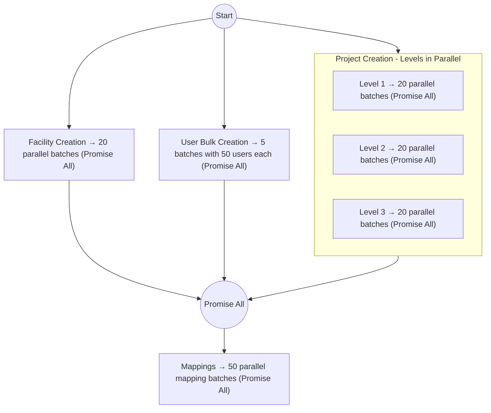

```mermaid
flowchart TD

    Start((Start))

    %% Project creation
    subgraph ProjectCreation [Project Creation - Levels in Parallel]
        direction LR
        L1["Level 1 → 20 parallel batches (Promise All)"]
        L2["Level 2 → 20 parallel batches (Promise All)"]
        L3["Level 3 → 20 parallel batches (Promise All)"]
    end

    %% Facility creation
    FacilityCreation["Facility Creation → 20 parallel batches (Promise All)"]

    %% User creation simplified
    UserCreation["User Bulk Creation → 5 batches with 50 users each (Promise All)"]

    %% Merge point
    Merge((Promise All))

    %% Mappings
    M1["Mappings → 50 parallel mapping batches (Promise All)"]

    %% Connections
    Start --> ProjectCreation --> Merge
    Start --> FacilityCreation --> Merge
    Start --> UserCreation --> Merge
    Merge --> M1
```
