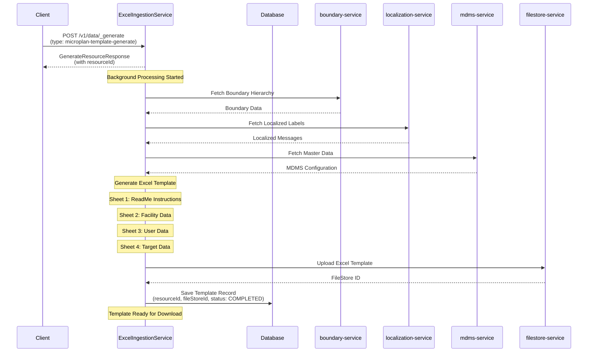
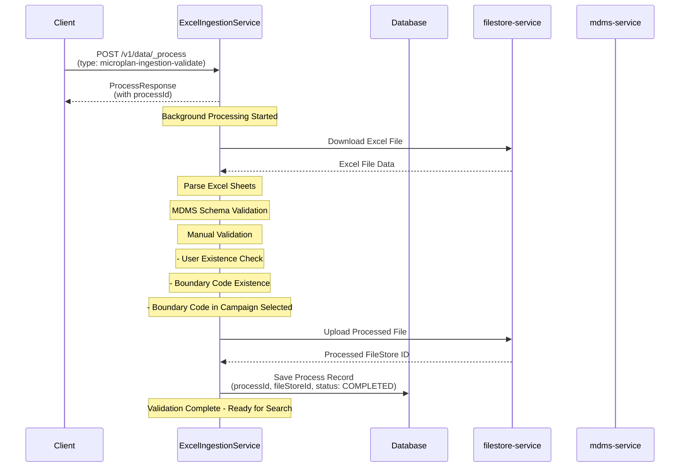
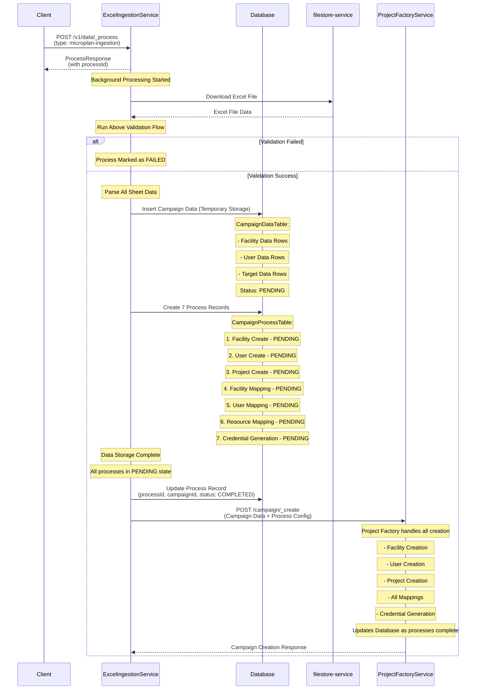

# Unified Microplan Workflow Design

## 1. Excel Template Generation
**Type:** `microplan-template-generate`  
**API:** `POST /v1/data/_generate` (Async - returns resourceId)  
**Download API:** `POST /v1/data/_download` (returns fileStoreId)

## 2. Validation Process
**Type:** `microplan-ingestion-validate`  
**API:** `POST /v1/data/_process` (Async - returns processId)  
**Search API:** `POST /v1/data/_search` (returns process status & fileStoreId if complete)

## 3. Data Storage & Campaign Creation
**Type:** `microplan-ingestion`  
**API:** `POST /v1/data/_process` (Async - returns processId)  
**Search API:** `POST /v1/data/_search` (returns process status & campaign details if complete)

